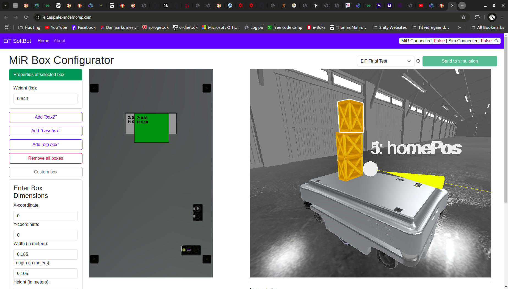

# EiT "SoftBoten"
GitHub page for the "Expert in Teams Innovation" project @ University of Southern Denmark E24

Experts in Teams "EiT" is a course at the engineering faculty that makes students work together across different specializations. 
This specific project is done across "Software Engineering" (for 10 ECTS) and "Advanced Robotics Technology" (for 15 ECTS).

Reference: https://www.sdu.dk/en/om-sdu/fakulteterne/teknik/samarbejde/studerende/expertsinteam

## Project
We are doing the "Logistics Optimization" industrial challenge. In short, the challenge consists of using a physics simulation to determine the maximize speed and acceleration of an AMR platform with a given unsecured box setup on top. The physics simulation should ensure that any given box setup does not fall over when driving. 

For the project, we were provided a MiR200 AMR platform. 

## Repository
This repository contains all parts of the project:
- `EiTSoftBot/`: A Blazor Server Web-UI to make box-configurations on top of a MiR200 platform.
  - Accessible at https://eit.app.alexandernorup.com/
- `mujocoSimulation/`: The physics simulation determining the max speed and acceleration for any given box-setup. The simulation recieves the box-configuration from ther Blazor Server Web-UI through MQTT.
- `MiRCommunicator/`: A simple client that recieves messages from teh Web-UI through MQTT and relays them to the MiR200 using it's REST api (See `MiR200RestClient/`)

## Architecture

This system relies on a MQTT broker. We used Eclipse Mosquitto V. 2.0.19. 

Run using Docker: `docker run -p 1883:1883 eclipse-mosquitto:2.0.19`

## Authors
* [Clara I.](https://github.com/Clingoss)
* [Rikke T.](https://github.com/Psykofairy)
* [Sebastian Christensen Mondrup](https://github.com/SebMon)
* [Alexander Vinding Nørup](https://github.com/AlexanderNorup)
